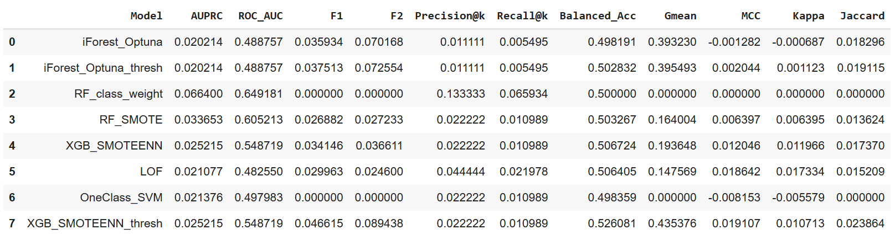
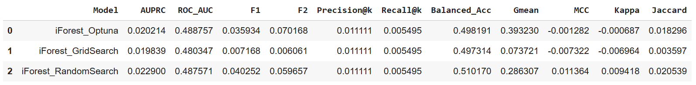
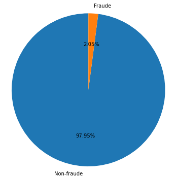
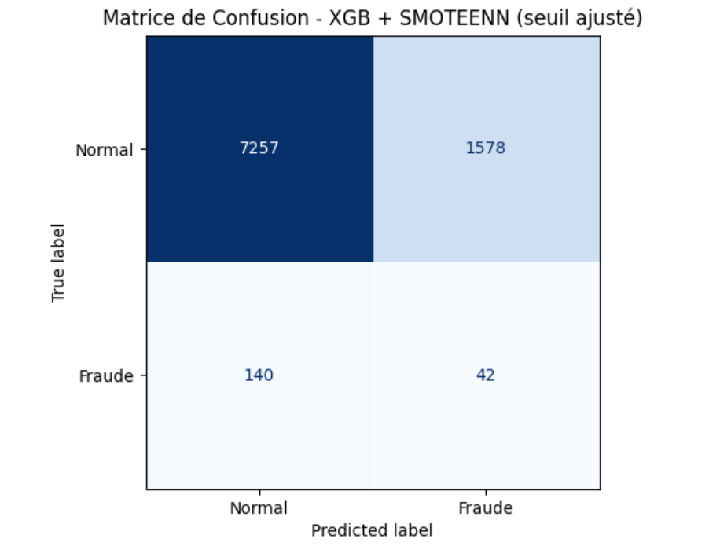
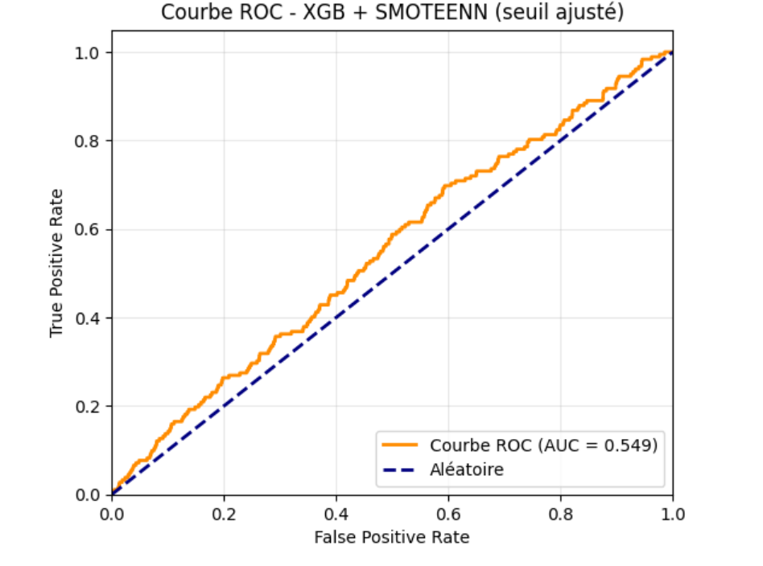
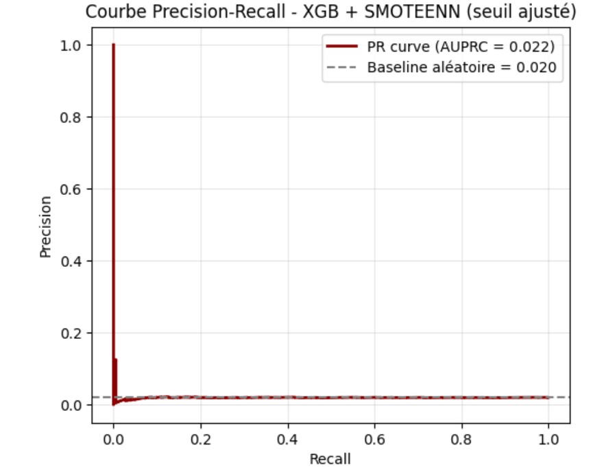
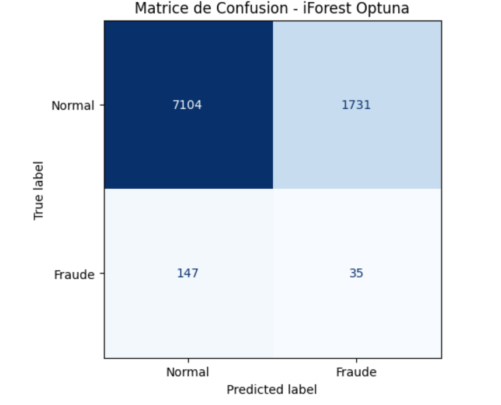
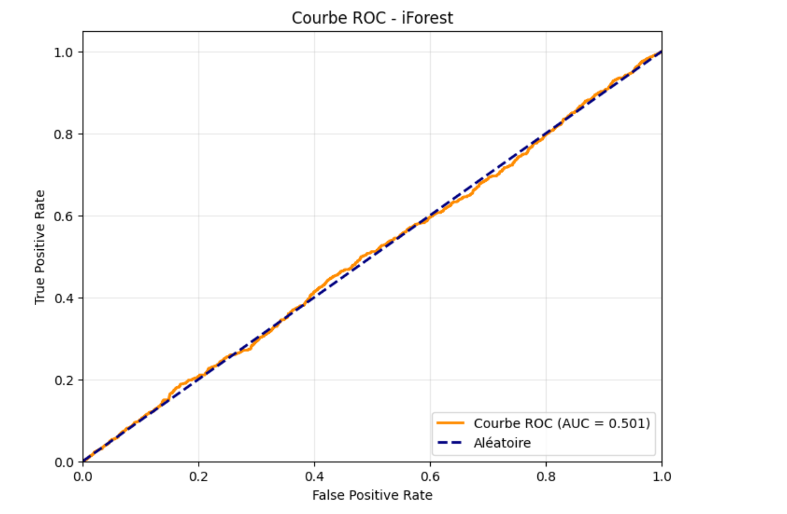
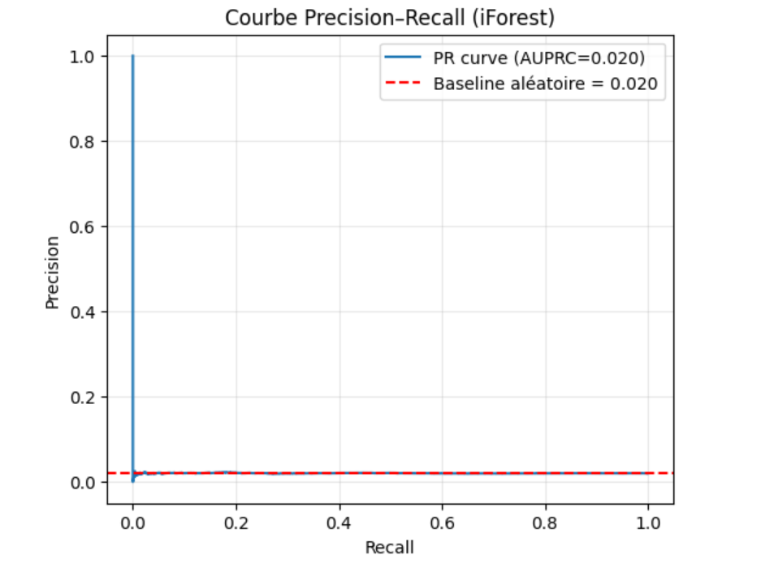

# Anomaly Detection for Credit Fraud — Isolation Forest and Supervised Alternatives

Replication and actuarial extension of the Isolation Forest algorithm (Liu, Ting & Zhou, 2008) on a realistic credit-application dataset with a 2 % fraud base rate. The study compares the reference unsupervised method against supervised alternatives (Random Forest, XGBoost) combined with class-imbalance techniques (SMOTE, SMOTEENN, class weighting, threshold tuning) using 15+ evaluation metrics designed to be stable under strong class imbalance.

Academic project (M2 Actuariat, ISFA — Data Science), supervised by François Hu. Co-authored with S. Diouf, C. A. D. Kouamé and S. Ouattara.

## What this project does

### 1. Methodology reference

Full theoretical synthesis of the Isolation Forest paper: iTree construction, path-length statistics, anomaly-score formula, ensemble aggregation, sub-sampling behaviour and the *swamping* / *masking* effects that motivate the algorithm's design.

### 2. Business framing — credit-fraud detection

- Dataset: `loan_applications.csv` — realistic transactional base for a lending institution
- Four variable families: loan characteristics, socio-economic profile, credit-risk indicators (CIBIL score, debt-to-income ratio), and outcomes (`loan_status`, `fraud_flag`)
- Actuarial rationale for iForest: rarity of frauds, scale-agnosticism, linear complexity, and use of the continuous anomaly score for triage

### 3. Data engineering

- Dataset cleaning
- Feature engineering
- Train/test split with stratification

### 4. Baseline: standard Isolation Forest

- Trained on `fraud_flag = 1` as the target
- Apparent Accuracy of 88.4 % but real performance close to random: AUC ≈ 0.50, Precision 1.97 %, Recall 9.77 %, F1 3.28 %, 90.2 % of frauds missed
- Illustrates the well-known "accuracy paradox" under strong class imbalance

### 5. Metrics for imbalanced classification

Introduction of metrics stable under imbalance: AUPRC, Precision@k, Recall@k, F1 / F2 scores, Balanced Accuracy, G-mean, Matthews Correlation Coefficient, Cohen's Kappa, Jaccard index.

### 6. Hyperparameter optimisation of iForest

Three optimisation strategies benchmarked:
- **GridSearchCV**
- **RandomSearchCV**
- **Optuna** (Bayesian TPE)

Optuna delivers the best iForest configuration but performance remains modest — motivation for supervised approaches.

### 7. Supervised alternatives and resampling

- **Random Forest** with class weighting (`class_weight`), best AUPRC ≈ 0.066 and ROC AUC ≈ 0.65
- **Random Forest + SMOTE** oversampling
- **XGBoost + SMOTEENN** (hybrid over/under-sampling)
- **XGBoost + SMOTEENN + threshold tuning** — final retained model
- Other detectors from the reference paper: Local Outlier Factor (LOF), One-Class SVM

### 8. Final comparison and operational interpretation

- Head-to-head comparison across all candidates on the 15 metrics
- Operational metric (Precision@k / Recall@k) simulating an audit budget of *k* investigations
- Final choice: XGBoost + SMOTEENN + threshold tuning — 19.05 % of test rows flagged, 76.9 % of frauds missed vs 80.8 % for the best unsupervised iForest

## Key numerical results

Full results table (all methods × all metrics):

Results for iForest with the three hyperparameter optimisation strategies:

Class imbalance visualisation (2 % fraud rate):

## Best model — XGBoost + SMOTEENN + threshold tuning

Confusion matrix, ROC and precision-recall curves:

## Reference baseline — Isolation Forest (Optuna)

For comparison, the best unsupervised model:

## Repository status

This repository currently contains the report PDF and the key result figures. The Python implementation exists (iForest with three hyperparameter optimisers, LOF, One-Class SVM, Random Forest with class weighting and SMOTE, XGBoost with SMOTEENN and threshold tuning, plus the imbalance-robust metric suite) but has not yet been ported here as standalone scripts — see `TODO.md`.

## Reference

Liu, F. T., Ting, K. M., & Zhou, Z.-H. (2008). *Isolation Forest*. In IEEE International Conference on Data Mining.

## Report

See `Rapport_Data_Science.pdf` for the full methodology, mathematical derivations, algorithm descriptions and quantitative results.
